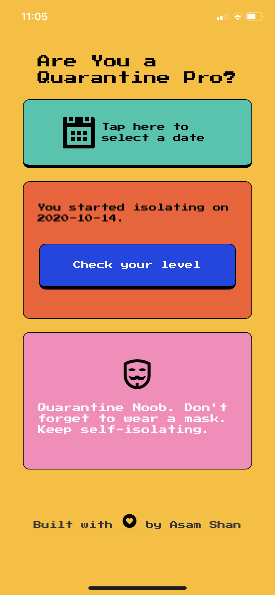

# Isolate

A simple expo application that indicates isolation ability and effectiveness. This application was built thanks to the great tutorial from [Aman Mittal](https://amanhimself.dev/blog/quarantine-pro-app) and served as my first time using Expo rather than the react native CLI.

### Features

- Ability to input a date when you started isolating
- Outputs a score and some useful information based on the length of your isolation

### Screenshots

